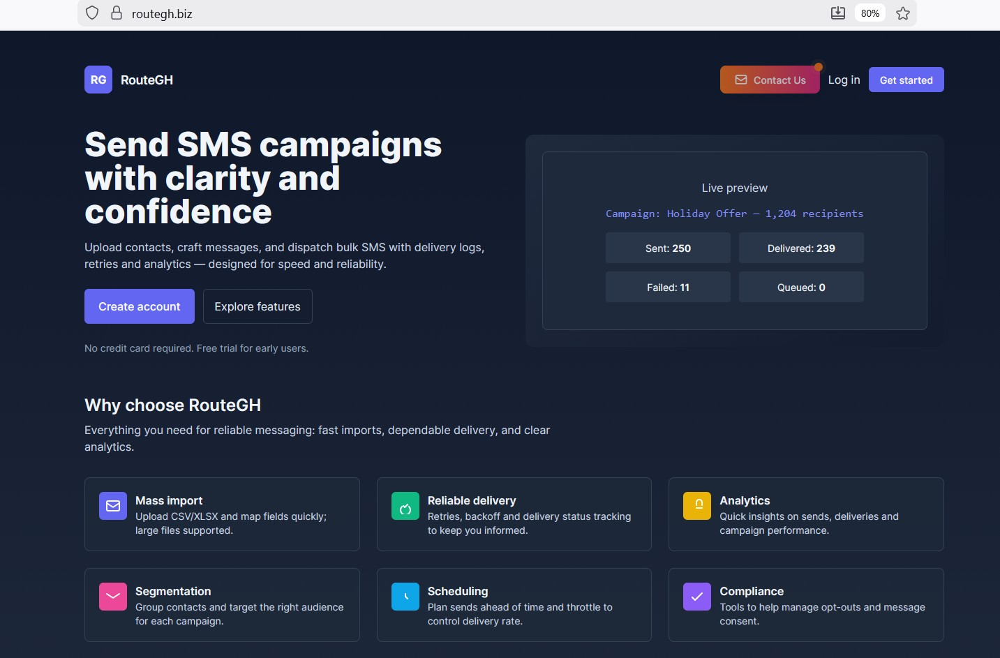
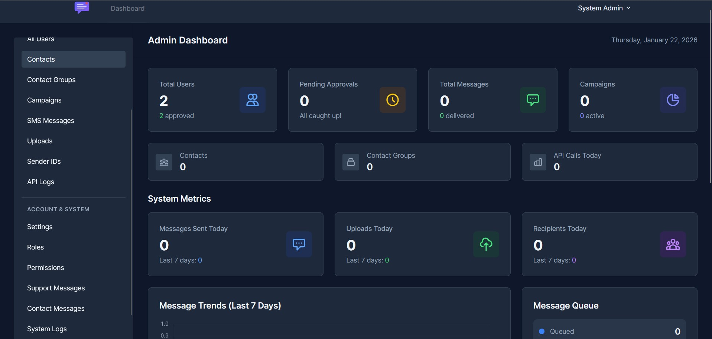

# Route Gh - Bulk SMS & Service Delivery Platform

<p align="center">
  
</p>

**Route Gh** is an all-in-one bulk messaging and service delivery platform built for your business growth. Send SMS campaigns, manage contacts, track delivery, and analyze performance—all from a single, intuitive dashboard.

---

## 📋 Table of Contents

- [Features](#-features)
- [Screenshots](#-screenshots)
- [Tech Stack](#-tech-stack)
- [System Requirements](#-system-requirements)
- [Installation](#-installation)
- [Configuration](#-configuration)
- [User Journey](#-user-journey)
- [Admin Features](#-admin-features)
- [Queue & Background Jobs](#-queue--background-jobs)
- [SMS Integration](#-sms-integration)
- [API Documentation](#-api-documentation)
- [Deployment](#-deployment)
- [Contributing](#-contributing)
- [License](#-license)

---

## ✨ Features

### Core Functionality
- **📱 Bulk SMS Campaigns** - Send thousands of messages instantly or schedule for later
- **👥 Contact Management** - Import/export contacts via CSV/XLSX with field mapping
- **📊 Contact Groups** - Organize contacts into groups for targeted campaigns
- **🎯 Sender ID Management** - Custom sender IDs with approval workflow
- **📅 Campaign Scheduling** - Schedule campaigns for future delivery
- **📈 Real-time Analytics** - Track sent, delivered, failed, and queued messages
- **🔍 API Logging** - Complete audit trail of all SMS API interactions
- **🔄 Automatic Retries** - Failed messages automatically retry with exponential backoff

### User Management
- **🔐 User Registration & Authentication** - Email and phone verification
- **✅ Admin Approval System** - New users require admin approval
- **🎭 Role-Based Access Control (RBAC)** - Admin, Moderator, Support, User roles
- **🔑 Granular Permissions** - 30+ permissions for fine-grained access control
- **💬 Support Messaging** - Direct communication between users and admins

### Admin Dashboard
- **📊 System Metrics** - Monitor campaigns, messages, users, and API usage
- **👤 User Management** - Approve/reject users, assign roles, manage sender IDs
- **📋 Campaign Oversight** - View all user campaigns and message logs
- **🔧 Settings & Configuration** - Manage system settings and integrations
- **📁 Upload History** - Track all contact imports across the platform

---

## 📸 Screenshots

### Landing Page
<p align="center">
  
</p>

### Admin Dashboard
<p align="center">
  
</p>

---

## 🛠️ Tech Stack

### Backend
- **Laravel 10** - PHP framework
- **MySQL / PostgreSQL** - Database
- **Queue System** - Database-driven job processing
- **Spatie Permission** - Role & permission management
- **Maatwebsite Excel** - CSV/XLSX import/export

### Frontend
- **Blade Templates** - Server-side rendering
- **Alpine.js** - Lightweight JavaScript framework
- **Tailwind CSS** - Utility-first CSS with dark mode
- **Vite** - Frontend build tool

### Integrations
- **FrogSMS API** - Primary SMS gateway
- **Twilio** - Backup SMS provider
- **Guzzle HTTP** - API client

---

## 💻 System Requirements

- PHP >= 8.1
- Composer
- Node.js >= 16.x & NPM
- MySQL >= 5.7 or PostgreSQL >= 12
- Redis (optional, for caching)

---

## 📦 Installation

### 1. Clone the Repository
```bash
git clone https://github.com/yourusername/routegh.git
cd routegh
```

### 2. Install Dependencies
```bash
# Install PHP dependencies
composer install

# Install Node dependencies
npm install
```

### 3. Environment Setup
```bash
# Copy environment file
cp .env.example .env

# Generate application key
php artisan key:generate
```

### 4. Database Setup
```bash
# Run migrations
php artisan migrate

# Seed roles and permissions
php artisan db:seed --class=RolesAndPermissionsSeeder

# (Optional) Seed demo data
php artisan db:seed
```

### 5. Build Assets
```bash
# Development
npm run dev

# Production
npm run build
```

### 6. Start Development Server
```bash
# Start Laravel server
php artisan serve

# Start queue worker (in separate terminal)
php artisan queue:work

# Start scheduler (in separate terminal, for scheduled campaigns)
php artisan schedule:work
```

Visit: `http://localhost:8000`

---

## ⚙️ Configuration

### Environment Variables

#### Application
```env
APP_NAME="Route Gh"
APP_ENV=local
APP_DEBUG=true
APP_URL=http://localhost:8000
```

#### Database
```env
DB_CONNECTION=mysql
DB_HOST=127.0.0.1
DB_PORT=3306
DB_DATABASE=routegh
DB_USERNAME=root
DB_PASSWORD=
```

#### Queue System
```env
QUEUE_CONNECTION=database
```

#### SMS Configuration
```env
SMS_DRIVER=frogsms

# FrogSMS Credentials
FROGSMS_BASE_URL=https://frog.wigal.com.gh/ismsweb/sendmsg
FROGSMS_USERNAME=your_username
FROGSMS_PASSWORD=your_password
FROGSMS_SENDER_ID=your_default_sender_id

# Twilio (Backup)
TWILIO_ACCOUNT_SID=your_account_sid
TWILIO_AUTH_TOKEN=your_auth_token
TWILIO_FROM=+1234567890
```

#### Mail Configuration
```env
MAIL_MAILER=smtp
MAIL_HOST=smtp.mailtrap.io
MAIL_PORT=2525
MAIL_USERNAME=your_username
MAIL_PASSWORD=your_password
MAIL_ENCRYPTION=tls
MAIL_FROM_ADDRESS=noreply@routegh.com
MAIL_FROM_NAME="${APP_NAME}"
```

---

## 🚀 User Journey

### For Regular Users

#### 1. **Registration & Verification**
- Register with email, phone, name
- Verify email via link
- Verify phone via OTP SMS
- Wait for admin approval

#### 2. **Create Sender ID**
- Navigate to Sender IDs
- Create new sender ID (max 11 characters)
- Add description
- Wait for admin approval

#### 3. **Import Contacts**
- Upload CSV/XLSX file
- Map columns (name, phone, email, etc.)
- Contacts organized in database
- Create contact groups for segmentation

#### 4. **Create Campaign**
- Choose contact group or all contacts
- Select approved sender ID
- Compose message (max 160 characters for single SMS)
- Send immediately or schedule for later
- Track status: pending → processing → completed

#### 5. **Monitor Results**
- View campaign details
- See message breakdown (sent, delivered, failed, queued)
- Check API logs for each message
- Retry failed messages

#### 6. **Support**
- Send messages to admin
- View conversation history
- Get help with issues

---

### For Administrators

#### 1. **User Approval**
- View pending users
- Approve or reject registrations
- Assign roles (admin, moderator, support, user)
- Send approval/rejection emails

#### 2. **Sender ID Management**
- Review sender ID requests
- Approve or reject
- Edit or delete sender IDs

#### 3. **Campaign Oversight**
- View all campaigns across users
- Monitor system-wide message statistics
- Check API logs
- Troubleshoot delivery issues

#### 4. **System Management**
- Manage roles and permissions
- View upload history
- Monitor system metrics
- Manage support messages

---

## 🔧 Admin Features

### User Management
- Approve/reject new registrations
- Assign roles: Admin, Moderator, Support, User
- Manage user permissions
- Delete users

### Sender ID Control
- Review sender ID requests
- Approve/reject sender IDs
- Set active/inactive status
- Associate sender IDs with users

### Campaign Administration
- View all campaigns
- Monitor campaign statuses
- Access detailed message logs
- View API interaction logs

### Roles & Permissions
- **Admin**: Full system access
- **Moderator**: Content management, no system settings
- **Support**: View and assist, limited editing
- **User**: Basic operations on own content

### System Monitoring
- Total campaigns
- Total messages sent
- User statistics
- API usage analytics

---

## 🔄 Queue & Background Jobs

Route Gh uses Laravel's queue system for background processing:

### Jobs

#### `ProcessSmsCampaignJob`
- Dispatched when campaign is created
- Creates individual SMS messages for each contact
- Updates campaign status
- Logs to `storage/logs/sms/frogSMS-*.log`

#### `SendSmsMessageJob`
- Sends individual SMS via API
- Logs API requests/responses
- Updates message status
- Handles failures and retries

### Starting Queue Workers

#### Development
```bash
php artisan queue:work --tries=3 --timeout=60
```

#### Production (using Supervisor)
```ini
[program:routegh-worker]
process_name=%(program_name)s_%(process_num)02d
command=php /path/to/routegh/artisan queue:work --sleep=3 --tries=3 --max-time=3600
autostart=true
autorestart=true
stopasserver=true
user=www-data
numprocs=4
redirect_stderr=true
stdout_logfile=/path/to/routegh/storage/logs/worker.log
stopwaitsecs=3600
```

### Scheduled Tasks

Add to crontab (production):
```bash
* * * * * cd /path/to/routegh && php artisan schedule:run >> /dev/null 2>&1
```

Or run manually (development):
```bash
php artisan schedule:work
```

### Monitoring Queues

```bash
# Check queue status
php artisan queue:monitor

# View failed jobs
php artisan queue:failed

# Retry failed jobs
php artisan queue:retry all

# Clear failed jobs
php artisan queue:flush
```

---

## 📱 SMS Integration

### FrogSMS (Primary)

Configuration in `config/services.php`:
```php
'frogsms' => [
    'base_url' => env('FROGSMS_BASE_URL'),
    'username' => env('FROGSMS_USERNAME'),
    'password' => env('FROGSMS_PASSWORD'),
    'senderid' => env('FROGSMS_SENDER_ID'),
],
```

### Twilio (Backup)

Configure Twilio credentials in `.env` and switch driver:
```env
SMS_DRIVER=twilio
```

### Adding New SMS Providers

1. Update `app/Services/SmsService.php`
2. Add configuration in `config/services.php`
3. Implement send logic in `sendMessageWithSender()` method

---

## 📚 API Documentation

Route Gh uses internal APIs for SMS delivery:

### SMS API Log Structure
```json
{
  "id": "uuid",
  "sms_message_id": "uuid",
  "request_payload": {
    "phone": "+233123456789",
    "message": "Hello World",
    "sender_id": "RouteGH"
  },
  "response_payload": {
    "status": "success",
    "message_id": "msg_12345",
    "cost": 0.05
  },
  "status_code": 200,
  "api_response_time": 1.25,
  "created_at": "2025-01-28T10:30:00.000000Z"
}
```

### Viewing API Logs

- **Users**: Campaign show page → "View API Log" button
- **Admins**: Admin campaigns → View API Log column

---

## 🚀 Deployment

### AWS Deployment

For comprehensive AWS deployment guide, see **[AWS_DEPLOYMENT.md](./AWS_DEPLOYMENT.md)**

Includes:
- RDS Database Setup
- ECS Fargate Containerization
- SQS Queue Configuration
- CloudWatch Monitoring
- Secrets Manager Integration
- Lambda Functions
- Load Balancer Setup

### Quick Production Checklist

- [ ] Set `APP_ENV=production`
- [ ] Set `APP_DEBUG=false`
- [ ] Configure production database
- [ ] Set up queue workers (Supervisor)
- [ ] Configure cron for scheduler
- [ ] Set up SSL certificate
- [ ] Configure mail server
- [ ] Set SMS provider credentials
- [ ] Run `php artisan optimize`
- [ ] Run `npm run build`
- [ ] Set proper file permissions
- [ ] Configure backup strategy

---

## 🤝 Contributing

We welcome contributions! Please follow these steps:

1. Fork the repository
2. Create a feature branch (`git checkout -b feature/AmazingFeature`)
3. Commit your changes (`git commit -m 'Add some AmazingFeature'`)
4. Push to the branch (`git push origin feature/AmazingFeature`)
5. Open a Pull Request

### Code Style
- Follow PSR-12 coding standards
- Use Laravel best practices
- Write descriptive commit messages
- Add tests for new features

---

## 📄 License

This project is licensed under the MIT License - see the [LICENSE](LICENSE) file for details.

---

## 💬 Support

- **Documentation**: See [QUICK_START.md](./QUICK_START.md) and [SMS_SETUP_GUIDE.md](./SMS_SETUP_GUIDE.md)
- **Issues**: GitHub Issues
- **GitHub**: 🌐[Lordgreatadri](https://github.com/Lordgreatadri)
- **Email**:  📧[lordgreatadri](lordgreatadri@gmail.com)

---

## 🙏 Acknowledgments

- Laravel Framework
- Spatie Permission Package
- FrogSMS API
- Twilio
- All contributors and testers

---

<p align="center">
  Made with ❤️ by <a href="https://github.com/Lordgreatadri/">Lordgreatadri</a><br>
  Project Developer | <a href="mailto:lordgreatadri@gmail.com">lordgreatadri@gmail.com</a>
</p>
